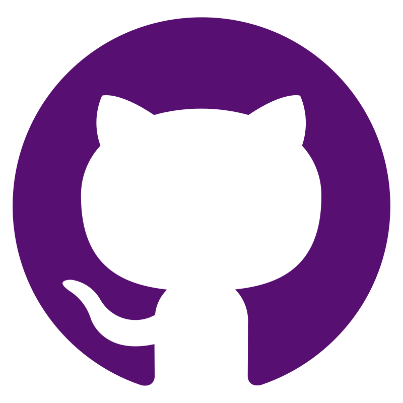

# Проект по автоматизации тестирования API pet store

<br>
<p align="center">

</p>
<br>

## :pushpin: Содержание:

- [Использованный стек технологий](#computer-использованный-стек-технологий)
- [Реализованные проверки](#computer-реализованные-проверки)
- [Запуск тестов](#running_woman-запуск-тестов)
- [Сборка в Jenkins](#-сборка-в-jenkins)
- [Пример Allure-отчета](#-пример-allure-отчета)
- [Уведомления в Telegram с использованием бота](#-уведомления-в-telegram-с-использованием-бота)

## :computer: Использованный стек технологий

<p align="center">





</p>

Автотесты написаны на <code>Java</code> с использованием <code>JUnit 5</code> и <code>Gradle</code>.
Для тестов использована библиотека [REST Assured](https://rest-assured.io/).
Запуск тестов можно осуществлять локально, непосредственно в Github или с помощью Jenkins.
Реализована сборка в <code>GitHub</code> с формированием Allure-отчета и доступ к нему по открытой ссылке, а так-же в <code>Jenkins</code> с формированием Allure-отчета и отправкой уведомления с результатами в <code>Telegram</code> после завершения прогона.

## :computer: Реализованные проверки

- [x] *POST /pet - создание новой учетной записи о животном в магазине*
- [x] *GET /pet/{petId} - получение данных о животном по Id*
- [x] *POST /pet/{petId} - обновление данных о животном (имя/статус)*
- [x] *PUT /pet - обновление данных о животном (все параметры)*
- [x] *DELETE /pet/{petId} - удаление данных о животном из базы магазина}*
- [x] *Для каждого метода была сделана одна негативная проверка*

## :running_woman: Запуск тестов

### Локальный запуск тестов
```
gradle clean test
```


### Запуск тестов на удаленном браузере из Jenkins
```
gradle clean test
```


##  <a href=""> Сборка Github Actions</a>

### Ниже предоставлены: статус сборки, ссылка на саму сборку и сформированный отчёт

>  [](https://github.com/pulsarList/PetStoreApiTest/actions/workflows/ci.yaml)
> <br>  **[Github Actions job](https://github.com/pulsarList/PetStoreApiTest/actions/runs/7030676379/job/19130691590)** <br/>  **[Allure отчёт](https://pulsarlist.github.io/PetStoreApiTest/5/)**


##  <a href="https://jenkins.autotests.cloud/job/Alfa_Test/15/"> Сборка в Jenkins</a>
<p align="center">

</p>

##  <a href="https://jenkins.autotests.cloud/job/Alfa_Test/15/allure/">Пример Allure-отчета</a>
### Overview

<p align="center">

</p>

### Результат выполнения теста

<p align="center">


</p>


###  Уведомления в Telegram с использованием бота


<p align="center">

</p>

